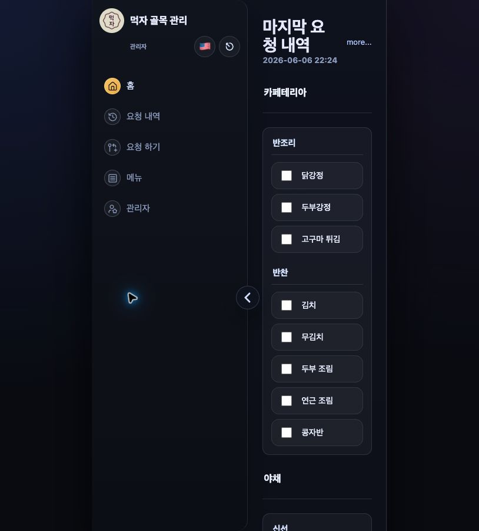
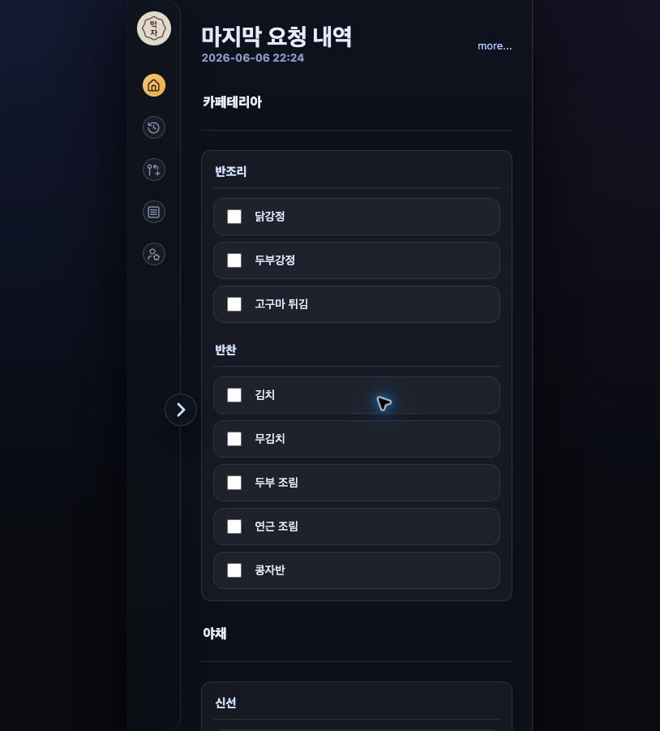
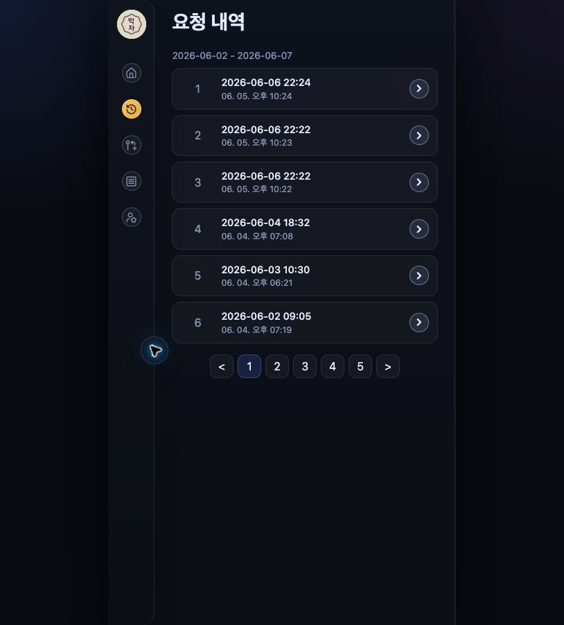
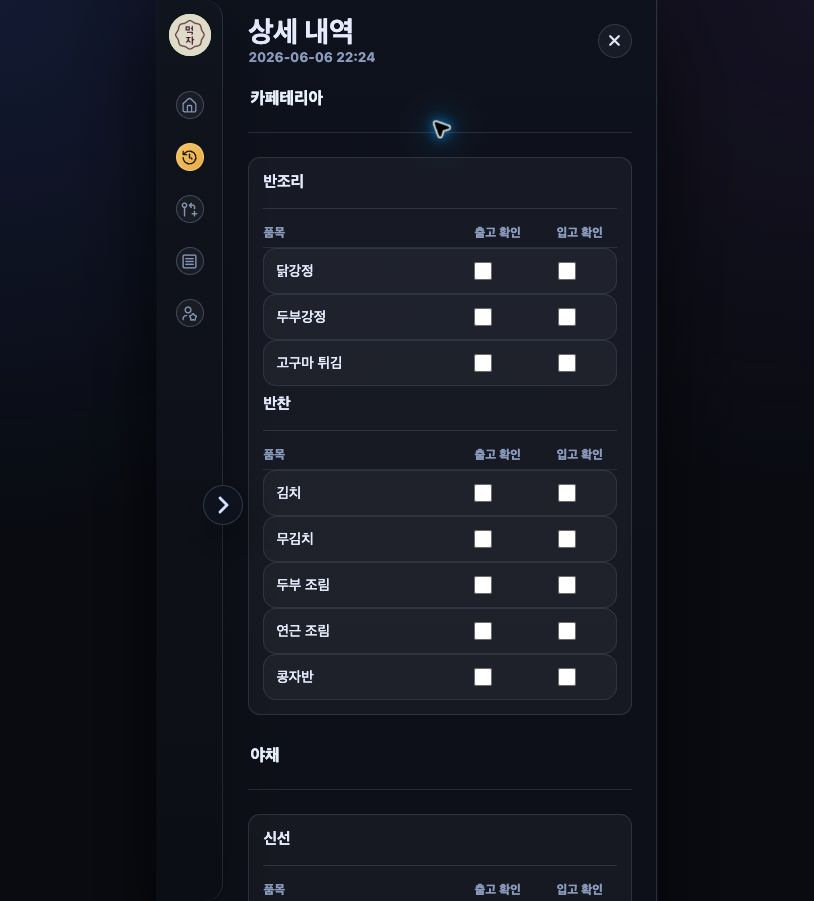
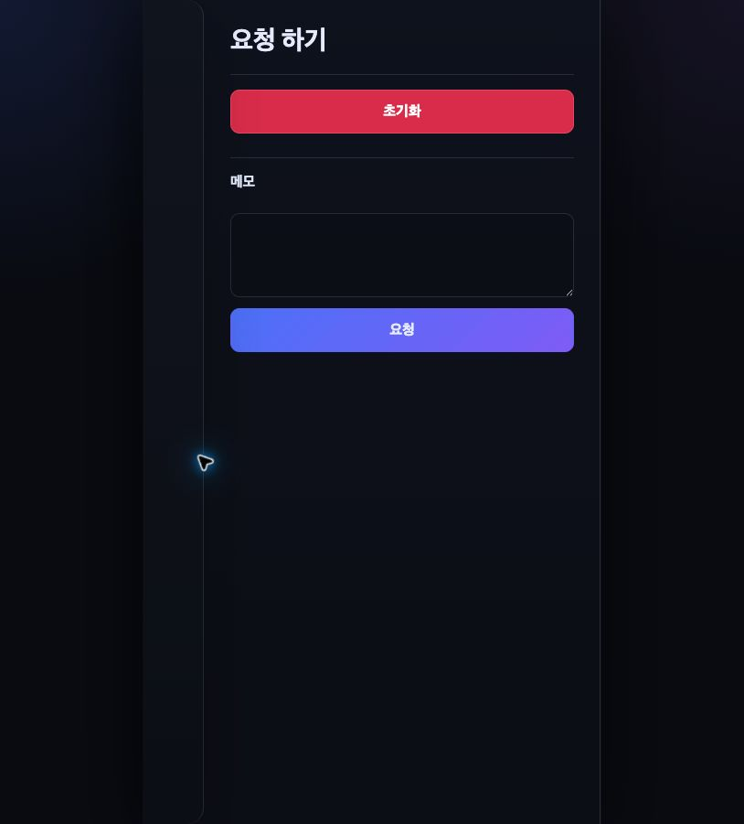
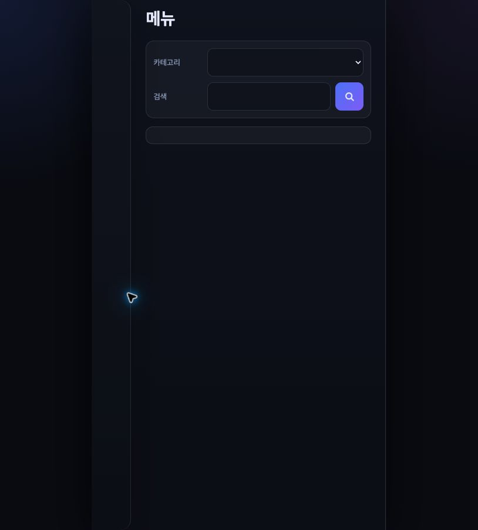
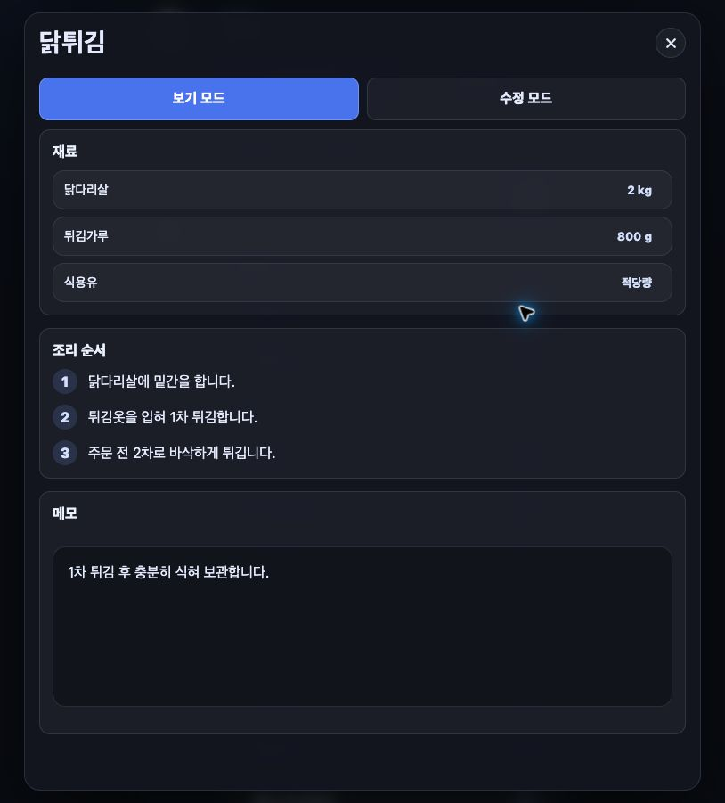
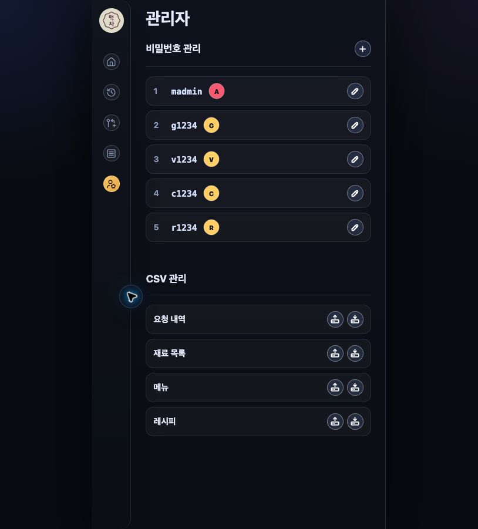

# 먹자 골목 관리 사용자 매뉴얼

작성일: 2026-06-06  
버전: Version 1.0
접속 주소: https://mukjamtl.netlify.app

이 문서는 먹자 골목 관리 앱 V1.0을 실제 사용자가 사용할 때 필요한 흐름을 설명합니다. 화면 캡처는 `docs/images`에 저장되어 있으며, V1.0 이후 기능 수정은 새 브랜치에서 진행하면서 기능 트리와 테스트 체크리스트를 함께 갱신합니다.

## 1. 로그인

앱은 회원가입 없이 입장 비밀번호로 사용자를 구분합니다.

| 사용자 | 비밀번호 | 사용 가능한 주요 기능 |
| --- | --- | --- |
| 카페테리아 | `c1234` | 카페테리아 요청 확인, 메모 작성 |
| 야채 | `v1234` | 야채 요청 확인, 메모 작성 |
| 매장 | `g1234` | 매장 요청 확인, 메모 작성 |
| 레스토랑 | `m1234` | 요청 작성, 전체 요청 확인, 입고 확인, 메뉴/레시피 조회 |
| 관리자 | `madmin` | 전체 기능, 재료/메뉴/레시피/부서/비밀번호/데이터 백업 관리 |

잘못된 비밀번호를 입력하면 오류 메시지가 표시됩니다. 권한이 없는 메뉴는 사이드바에서 흐리게 표시되며 들어갈 수 없습니다.

## 2. 사이드바와 공통 기능

왼쪽 사이드바에서 페이지를 이동합니다.



| 메뉴 | 설명 |
| --- | --- |
| 홈 | 최근 요청과 입고/메모 확인 |
| 요청 내역 | 저장된 요청 내역 조회 |
| 요청하기 | 레스토랑/관리자 요청 작성 |
| 메뉴 | 메뉴와 연결 레시피 조회/관리 |
| 레시피 | 전체 레시피 조회/관리 |
| 관리자 | 부서, 비밀번호, 데이터 백업 관리 |

사이드바 상단의 언어 버튼으로 한글/영어를 전환할 수 있습니다. 로그아웃 버튼을 누르면 현재 브라우저의 로그인 상태가 해제됩니다. 관리자 화면의 각 관리 섹션은 제목 오른쪽의 접기/펼치기 버튼으로 접을 수 있습니다.

## 3. 홈

홈은 로그인 권한에 따라 표시 범위가 달라집니다.



- 홈은 요청 내역 DB에서 가장 최근에 저장/수정된 요청을 우선 표시합니다.
- 카페테리아, 야채, 매장, 먹자: 자기 부서로 들어온 최근 요청만 표시
- 레스토랑, 관리자: 전체 부서의 최근 요청 표시

요청 품목은 부서와 카테고리별로 묶여 표시됩니다. 레스토랑과 관리자는 체크 박스로 입고/출고 상태를 저장할 수 있습니다.

메모는 요청별로 저장됩니다. 내 권한의 메모는 수정할 수 있고, 다른 부서가 작성한 메모는 읽기 전용으로 표시됩니다.

예외 상황:

- 저장된 요청이 없으면 `저장된 주문내역이 없습니다.`가 표시됩니다.
- 다른 부서 메모는 수정할 수 없습니다.
- DB가 일시적으로 느리면 화면 복귀/새로고침 시 최신 데이터를 다시 불러옵니다.

## 4. 요청 내역

요청 내역은 화요일부터 일요일까지 주 단위로 표시됩니다.



주차 이동 버튼으로 이전/다음 묶음을 볼 수 있습니다. 목록에서 요청 행을 누르면 상세 화면이 열립니다.

상세 화면에서는 요청 품목이 부서별, 카테고리별로 나뉘어 표시됩니다. 관리자는 상세 화면에서 출고/입고 체크를 수정할 수 있습니다.



예외 상황:

- 해당 주에 데이터가 없으면 빈 상태 메시지가 표시됩니다.
- 권한이 제한된 부서 사용자는 자기 부서 요청 중심으로 확인합니다.

## 5. 요청하기

요청하기 화면은 레스토랑과 관리자만 사용할 수 있습니다.



### 주문 모드

1. 필요한 품목을 체크합니다.
2. 필요한 경우 메모를 입력합니다.
3. `요청` 버튼을 누릅니다.
4. 저장된 요청은 홈과 요청 내역에 표시됩니다.
5. 요청 저장 후 부서별 요청 메시지가 자동으로 생성됩니다.
6. 각 부서 메시지는 복사 버튼으로 복사할 수 있고, 메시지 아래의 `카톡 열기` 버튼으로 카카오톡 앱을 열 수 있습니다.

요청하기 화면은 마지막 요청 상태를 불러옵니다. 마지막 요청을 수정해 저장하면 같은 요청의 마지막 상태로 업데이트되며, 홈과 요청 내역에는 최신 저장 상태가 표시됩니다.
품목과 메모가 모두 비어 있으면 저장되지 않습니다. 메모만 입력한 경우에도 요청 내역에 메모 요청으로 저장되며, 홈 화면에서는 품목 목록 없이 메모 패널만 표시됩니다. 초기화 후 저장 전에는 취소 버튼으로 마지막 저장 상태를 다시 불러올 수 있습니다.

부서별 메시지는 요청하기 화면에 저장된 카테고리 순서와 품목 순서를 기준으로 생성됩니다. 카테고리별로 품목을 묶고, 마지막 줄에 `필요합니다`를 표시합니다.

카카오톡 열기 버튼은 카카오톡 앱 실행 링크입니다. 자동으로 특정 채팅방에 메시지를 전송하지는 않습니다.

부서 제목 줄의 접기/펼치기 버튼으로 해당 부서의 모든 카테고리를 한 번에 접거나 펼칠 수 있습니다. 카테고리 제목 줄의 접기/펼치기 버튼으로 긴 품목 목록을 접을 수 있습니다.

### 수정 모드

수정 모드는 관리자만 사용할 수 있습니다.

관리자는 재료 품목을 추가, 수정, 삭제할 수 있습니다. 여러 품목을 선택해 부서와 카테고리를 한 번에 변경할 수 있고, 품목 순서와 카테고리 순서도 이동할 수 있습니다.
부서 제목 줄의 접기/펼치기 버튼으로 해당 부서의 모든 카테고리를 한 번에 접거나 펼칠 수 있습니다. 카테고리 추가는 부서 제목 줄의 원형 `+` 아이콘으로 실행합니다.

카테고리 제목 줄의 접기/펼치기 버튼으로 긴 품목 목록을 접을 수 있습니다. 접힌 카테고리는 카테고리명, 펼침 버튼, 이동 핸들만 표시되며, 카테고리명을 누르면 해당 위치로 포커스가 이동합니다. 카테고리 사이에는 회색 기준선이 표시되고, 드래그 중 놓을 수 있는 위치는 노란색 선으로 바뀝니다.

예외 상황:

- 권한이 없으면 `이 기능을 사용할 권한이 없습니다.`가 표시됩니다.
- 품목과 메모가 모두 비어 있으면 요청 내역에 저장하지 않습니다.
- 메모만 입력해도 요청 내역에 메모 요청으로 저장합니다.
- 취소 버튼은 저장 전 변경 내용을 버리고 마지막 저장 상태를 다시 불러옵니다.
- 재료 품목의 한글명과 영문명은 필수입니다.
- 같은 부서에 이미 같은 품목명이 있으면 팝업으로 중복을 알리고 저장하지 않습니다.
- 수정 폼이 열려 있는 동안에는 복사/붙여넣기 중 드래그가 걸리지 않도록 품목/카테고리 이동이 비활성화됩니다.
- 체크박스가 하나만 선택된 경우 불필요한 펼침 동작을 하지 않습니다.
- 카테고리 이동은 같은 부서 안에서만 가능합니다.

## 6. 메뉴

메뉴 화면은 레스토랑과 관리자만 사용할 수 있습니다.



### 보기 모드

- 카테고리 필터로 메뉴를 좁혀 볼 수 있습니다.
- 검색어로 메뉴를 찾을 수 있습니다.
- 메뉴명 옆에 가격이 표시됩니다.
- 판매 중단 메뉴는 메뉴명에 취소선이 표시됩니다.
- 계절 메뉴는 배지로 표시됩니다.
- 카테고리 제목 줄의 접기/펼치기 버튼으로 긴 메뉴 그룹을 접을 수 있습니다.
- 레시피 아이콘을 누르면 연결 레시피 팝업이 열립니다.

### 수정 모드

수정 모드는 관리자만 사용할 수 있습니다.

관리자는 메뉴를 추가, 수정, 삭제할 수 있습니다. 메뉴명, 영문명, 카테고리, 가격, 판매 상태, 계절 메뉴 여부를 관리합니다. 메뉴를 새로 만들면 연결된 빈 레시피도 함께 생성됩니다. 메뉴 카테고리를 접으면 추가 버튼과 메뉴 목록이 숨겨지고 접기/펼치기 버튼만 남습니다.

예외 상황:

- 이미 같은 한글 메뉴명이 있으면 팝업으로 중복을 알리고 저장하지 않습니다.
- 메뉴의 한글명과 영문명은 필수입니다.
- 가격이 비어 있으면 보기 모드에서 가격 라벨을 표시하지 않습니다.
- 한글 메뉴명에는 한글명이 들어가고, 영문 메뉴명은 별도 필드로 관리합니다.
- DoorDash 원본처럼 불어/영어가 함께 들어온 데이터는 영어 또는 한글 기준으로 정리했습니다.

## 7. 레시피

레시피는 모든 로그인 사용자가 조회할 수 있습니다.



보기 모드에서는 레시피 설명, 재료, 양념/시즈닝, 조리 순서, 사진, 메모를 확인합니다.

관리자는 수정 모드에서 다음 작업을 할 수 있습니다.

- 레시피 설명 수정
- 재료 추가/수정/삭제
- 조리 순서 추가/수정/삭제
- 조리 사진 URL 또는 파일 입력
- 재료와 조리 순서 순서 이동
- 레시피 삭제

예외 상황:

- 사진이 없는 조리 순서는 사진 버튼이 비활성화됩니다.
- 수정 폼이 열려 있는 행은 드래그가 비활성화됩니다.
- 삭제는 확인 창을 거친 뒤 실행됩니다.

## 8. 관리자

관리자 페이지는 관리자만 사용할 수 있습니다.



### 부서 관리

관리자는 부서를 추가, 수정, 삭제할 수 있습니다. 부서에는 한글 부서명, 영문 부서명, 사용 여부가 있습니다.

부서명은 요청하기 재료 목록, 홈/요청 내역 부서 필터, 부서별 메모, 접근 계정의 기준값으로 사용됩니다. 부서명을 수정하면 관련 재료, 요청 내역, 메모, 접근 계정의 부서 참조가 함께 이관됩니다.

이미 재료, 요청 내역, 메모, 접근 계정에서 사용 중인 부서는 삭제하거나 비활성화할 수 없습니다. 최소 한 개 이상의 사용 중 부서가 있어야 합니다.

### 비밀번호 관리

관리자는 입장 비밀번호를 추가, 수정, 삭제할 수 있습니다. 사용자 역할과 부서를 관리합니다. 부서 역할 선택지는 부서 DB에 등록된 사용 중 부서를 기준으로 표시됩니다.

마지막 관리자 계정은 삭제할 수 없습니다.

비밀번호 계정은 추후 회원 관리 확장을 위해 내부 사용자 DB와 연결되지만, 아직 회원 관리 화면은 제공하지 않습니다.

### 데이터 백업

아래 데이터를 CSV로 내보내거나 가져올 수 있습니다.

| 항목 | 설명 |
| --- | --- |
| 요청 내역 | 저장된 요청, 체크, 메모 데이터 |
| 재료 목록 | 요청하기 화면의 재료 품목 |
| 메뉴 | 메뉴명, 카테고리, 가격, 판매 상태 |
| 레시피 | 레시피 설명, 재료, 순서, 메모 |

CSV 가져오기는 기존 데이터를 교체하므로 확인 창을 거친 뒤 실행됩니다.

전체 CSV 백업 묶음 생성 기능은 내부 함수로 준비되어 있지만, 현재 화면에는 별도 버튼으로 표시하지 않습니다.

## 9. 화면이 예전처럼 보일 때

브라우저 캐시 때문에 이전 화면이 보일 수 있습니다. 아래 주소를 한 번 열면 서비스워커와 캐시를 정리하고 앱으로 돌아갑니다.

```text
https://mukjamtl.netlify.app/reset-cache.html
```

그래도 바뀌지 않으면 브라우저 탭을 완전히 닫고 다시 열어 주세요.

## 10. 운영 전 확인 순서

1. 관리자 코드로 로그인합니다.
2. 요청하기에서 재료 목록이 부서/카테고리별로 보이는지 확인합니다.
3. 테스트 요청을 하나 저장합니다.
4. 요청 후 부서별 메시지가 생성되고, 복사/카톡 열기 버튼이 보이는지 확인합니다.
5. 홈에 최신 요청이 보이는지 확인합니다.
6. 요청 내역 상세에서 부서/카테고리와 체크가 맞는지 확인합니다.
7. 메뉴 보기 모드에서 메뉴명 옆 가격이 보이는지 확인합니다.
8. 메뉴 레시피 팝업이 열리는지 확인합니다.
9. 레시피 수정 모드에서 재료/순서 폼과 드래그가 충돌하지 않는지 확인합니다.
10. 관리자에서 부서 목록과 비밀번호의 부서 선택지가 맞는지 확인합니다.
11. 관리자 CSV Export/Import를 테스트합니다.
12. 이상이 없으면 DB 초기화와 운영 데이터 Import를 진행합니다.
