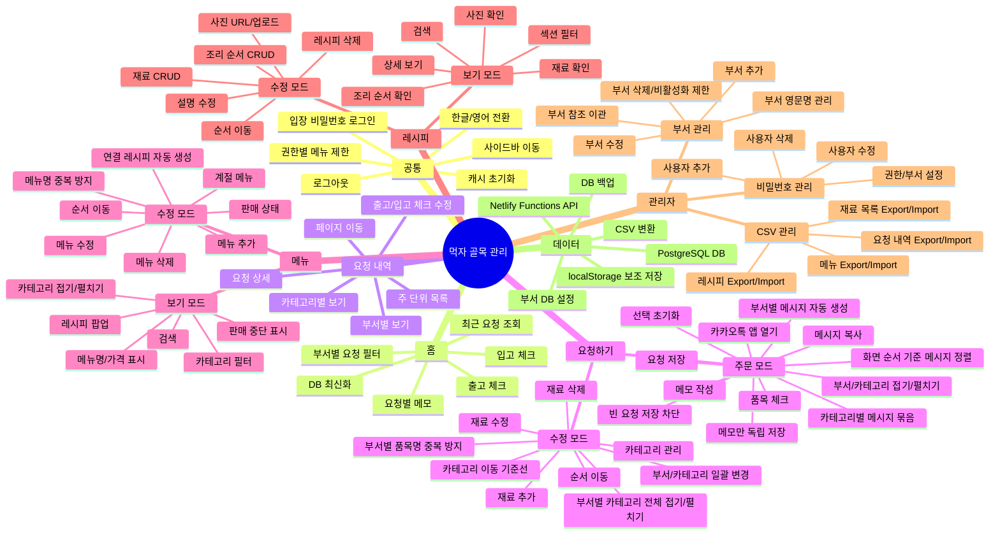

# 먹자 골목 관리 기능 트리

작성일: 2026-06-06  
대상 앱: https://mukjamtl.netlify.app

이 문서는 V1.0 매뉴얼 작성과 화면 기능 테스트를 시작하기 전에 앱 전체 기능을 한 번에 보기 위한 기능 지도입니다.

## 전체 마인드맵

## 권한별 기능

| 권한 | 접속 코드 | 홈 | 요청 내역 | 요청하기 | 메뉴 | 레시피 | 관리자 |
| --- | --- | --- | --- | --- | --- | --- | --- |
| 카페테리아 | `c1234` | 자기 부서 요청/메모 | 자기 부서 요청 조회 | 사용 불가 | 사용 불가 | 조회 | 사용 불가 |
| 야채 | `v1234` | 자기 부서 요청/메모 | 자기 부서 요청 조회 | 사용 불가 | 사용 불가 | 조회 | 사용 불가 |
| 그로서리 | `g1234` | 자기 부서 요청/메모 | 자기 부서 요청 조회 | 사용 불가 | 사용 불가 | 조회 | 사용 불가 |
| 레스토랑 | `m1234` | 전체 요청/입고 체크 | 전체 요청 조회 | 주문 모드 | 메뉴/레시피 조회 | 조회 | 사용 불가 |
| 관리자 | `madmin` | 전체 요청/체크/메모 | 전체 요청 조회/체크 수정 | 주문/수정 모드 | 보기/수정 모드 | 보기/수정 모드 | 전체 관리 |

## 페이지별 기능 트리

### 1. 공통 레이아웃

- 로그인 게이트
- 권한별 시작 페이지 이동
- 사이드바 메뉴
- 현재 페이지 표시
- 권한 없는 메뉴 비활성화
- 사이드바 접기/펼치기
- 언어 전환
- 로그아웃
- 서비스워커 캐시 정리
- DB 사용 가능 여부 확인

### 2. 홈

- 최근 요청 1건 또는 최신 요청 묶음 조회
- 권한별 표시 범위 분기
- 부서 사용자는 자기 부서 품목만 조회
- 레스토랑/관리자는 전체 부서 품목 조회
- 부서/카테고리별 품목 그룹 표시
- 출고 체크 저장
- 입고 체크 저장
- 요청별 메모 작성
- 메모 저장
- 메모 초기화
- 브라우저 포커스/탭 복귀 시 DB 최신화

### 3. 요청 내역

- 화요일부터 일요일까지 주 단위 조회
- 주차 페이지 이동
- 목록 행 선택
- 상세 화면 열기
- 상세 화면 닫기
- 상세 메타 정보 표시
- 부서별 요청 품목 표시
- 카테고리별 요청 품목 표시
- 출고 체크 표시/수정
- 입고 체크 표시/수정
- 권한별 읽기/수정 제한

### 4. 요청하기

#### 주문 모드

- 재료 목록 DB 로드
- 부서별 섹션 표시
- 카테고리별 품목 표시
- 품목 체크/해제
- 하나만 선택된 경우 불필요한 펼침 방지
- 메모 입력
- 품목과 메모가 모두 비어 있으면 저장 차단
- 메모만 있으면 요청 내역 없이 독립 메모 저장
- 요청 저장
- 요청 저장 후 요청 내역 생성
- 요청 저장 후 부서별 요청 메시지 자동 생성
- 화면에 저장된 카테고리/품목 순서 기준으로 메시지 생성
- 카테고리별 품목 묶음과 마지막 줄 필요 문구 표시
- 부서별 요청 메시지 복사
- 메시지 아래 카카오톡 앱 열기
- 보기 모드 부서/카테고리 접기/펼치기
- 선택 초기화

#### 수정 모드

- 재료 품목 추가
- 재료 품목 수정
- 재료 품목 삭제
- 재료 한글명/영문명 필수 입력 검증
- 같은 부서 안의 품목명 중복 저장 방지
- 한글명/영문명 관리
- 부서 관리
- 카테고리 관리
- 카테고리 영문명 관리
- 단위 관리
- 사용 여부 관리
- 체크된 여러 품목 일괄 부서/카테고리 변경
- 선택 품목 위치 이동
- 카테고리 추가
- 카테고리명 수정
- 카테고리 삭제
- 부서별 카테고리 전체 접기/펼치기
- 카테고리 접기/펼치기
- 접힌 카테고리 제목 클릭 포커스
- 카테고리 이동 기준선 표시
- 카테고리 순서 이동
- 입력 폼이 열려 있을 때 품목/카테고리 이동 비활성화

### 5. 메뉴

#### 보기 모드

- 메뉴 목록 조회
- 카테고리별 그룹 표시
- 카테고리 필터
- 검색
- 메뉴명 표시
- 메뉴명 옆 가격 표시
- 카테고리 접기/펼치기
- 판매 중단 메뉴 취소선 표시
- 계절 메뉴 배지 표시
- 레시피 팝업 열기
- 레시피 팝업 닫기

#### 수정 모드

- 메뉴 추가
- 메뉴 수정
- 메뉴 삭제
- 메뉴 한글명/영문명 필수 입력 검증
- 메뉴명 중복 저장 방지
- 한글 메뉴명 관리
- 영문 메뉴명 관리
- 메뉴 카테고리 관리
- 가격 관리
- 판매/판매 중지 상태 관리
- 계절 메뉴 설정
- 메뉴 순서 드래그 이동
- 수정 모드 카테고리 접기/펼치기
- 메뉴 생성 시 빈 레시피 자동 생성
- 메뉴 수정 시 연결 레시피 동기화
- 입력 폼이 열려 있을 때 행 드래그 비활성화

#### 메뉴 안의 레시피 팝업

- 연결 레시피 조회
- 재료 목록 조회
- 조리 순서 조회
- 조리 사진 보기
- 관리자 수정 모드 전환
- 팝업 안에서 레시피 수정
- 팝업 안에서 레시피 삭제

### 6. 레시피

#### 보기 모드

- 레시피 목록 조회
- 검색
- 섹션 필터
- 상세 보기
- 설명 표시
- 재료 표시
- 양념/시즈닝 표시
- 조리 순서 표시
- 사진 표시
- 메모 표시

#### 수정 모드

- 레시피 본문 수정
- 레시피 설명 수정
- 재료 항목 추가
- 재료 항목 수정
- 재료 항목 삭제
- 재료 순서 이동
- 조리 순서 추가
- 조리 순서 수정
- 조리 순서 삭제
- 조리 순서 사진 URL/파일 입력
- 조리 순서 이동
- 메모 수정
- 레시피 삭제
- 입력 폼이 열려 있을 때 행 드래그 비활성화

### 7. 관리자

#### 비밀번호 관리

- 사용자 목록 조회
- 사용자 추가
- 사용자 수정
- 사용자 삭제
- 비밀번호 변경
- 역할 변경
- 부서 변경
- 부서 DB 기준 역할 선택
- 표시 이름 변경
- 마지막 관리자 삭제 방지

#### 부서 관리

- 부서 목록 조회
- 부서 한글명 관리
- 부서 영문명 관리
- 부서 사용 여부 관리
- 새 부서 추가
- 부서명 변경 시 재료/요청 내역/메모/접근 계정 참조 이관
- 사용 중인 부서 삭제/비활성화 방지
- 사용 중 부서 최소 1개 유지

#### CSV 관리

- 요청 내역 CSV 내보내기
- 요청 내역 CSV 가져오기
- 재료 목록 CSV 내보내기
- 재료 목록 CSV 가져오기
- 메뉴 CSV 내보내기
- 메뉴 CSV 가져오기
- 레시피 CSV 내보내기
- 레시피 CSV 가져오기
- 가져오기 전 확인 창
- 가져오기 후 DB 교체

### 8. 데이터와 API

- `/api/health` DB 연결 확인
- `/api/settings` 앱 설정 조회/저장
- `app_settings.departments` 부서 DB 설정 조회/저장
- `/api/access-accounts` 입장 계정 조회/저장
- `/api/history` 요청 내역 CRUD
- `/api/history/:id` 요청 삭제
- `/api/ingredients` 재료 목록 CRUD
- `/api/menus` 메뉴 CRUD
- `/api/recipes` 레시피 CRUD
- DB 우선 저장
- API 실패 시 localStorage 보조 저장
- CSV 변환/파싱
- 접근 로그 저장
- 익명 identity 기록

## 매뉴얼 캡처 우선순위

| 우선순위 | 화면 | 캡처/확인 포인트 |
| --- | --- | --- |
| 1 | 로그인 | 권한별 접속 코드, 실패 메시지 |
| 2 | 사이드바 | 권한별 메뉴 표시/비활성화, 언어 전환, 로그아웃 |
| 3 | 홈 | 최근 요청, 체크 저장, 부서 메모 |
| 4 | 요청하기 주문 모드 | 품목 선택, 메모, 요청 저장 |
| 5 | 요청 내역 | 목록, 주차 이동, 상세 화면 |
| 6 | 요청하기 수정 모드 | 재료 CRUD, 일괄 이동, 카테고리 관리 |
| 7 | 메뉴 보기 모드 | 카테고리/검색, 메뉴명+가격, 레시피 팝업 |
| 8 | 메뉴 수정 모드 | 메뉴 CRUD, 가격/상태/순서 이동 |
| 9 | 레시피 보기/수정 | 재료/순서 CRUD, 사진, 삭제 |
| 10 | 관리자 | 비밀번호 CRUD, 부서 CRUD, CSV Export/Import |
| 11 | 캐시 초기화 | reset-cache 페이지 |

## 테스트 체크리스트 초안

### 공통

- [ ] 각 권한 코드로 로그인된다.
- [ ] 잘못된 비밀번호에서 오류가 표시된다.
- [ ] 권한 없는 메뉴가 비활성화된다.
- [ ] 언어 전환이 동작한다.
- [ ] 로그아웃이 동작한다.
- [ ] 모바일 폭에서 사이드바가 깨지지 않는다.

### 홈

- [ ] 부서 권한은 자기 부서 품목만 보인다.
- [ ] 레스토랑/관리자는 전체 부서 품목이 보인다.
- [ ] 출고 체크가 저장된다.
- [ ] 입고 체크가 저장된다.
- [ ] 메모 저장/초기화가 동작한다.
- [ ] 새로고침 후에도 저장 상태가 유지된다.

### 요청 내역

- [ ] 주차 페이지 이동이 동작한다.
- [ ] 요청 목록에서 상세 화면으로 이동한다.
- [ ] 상세 화면에서 부서/카테고리 그룹이 맞다.
- [ ] 관리자 체크 수정이 저장된다.
- [ ] 상세 닫기가 동작한다.

### 요청하기

- [ ] 품목 선택과 해제가 동작한다.
- [ ] 메모와 함께 요청 저장이 된다.
- [ ] 품목과 메모가 모두 비어 있으면 요청 내역이 저장되지 않는다.
- [ ] 메모만 있으면 요청 내역 없이 메모만 저장되고 홈에서 메모만 보인다.
- [ ] 요청 저장 후 부서별 메시지가 자동 생성된다.
- [ ] 메시지 품목은 화면 카테고리/품목 순서대로 보인다.
- [ ] 메시지는 카테고리별 라인으로 묶이고 `필요합니다`가 마지막 줄에 보인다.
- [ ] 부서별 메시지 복사가 동작한다.
- [ ] 각 메시지 아래 카톡 열기 버튼이 보인다.
- [ ] 별도 요청 메시지 만들기 버튼은 보이지 않는다.
- [ ] 저장된 요청이 홈/요청 내역에 표시된다.
- [ ] 보기 모드에서 부서/카테고리 접기와 펼치기가 동작한다.
- [ ] 수정 모드에서 재료 추가가 된다.
- [ ] 수정 모드에서 재료 수정이 된다.
- [ ] 수정 모드에서 재료 삭제가 된다.
- [ ] 재료 한글명/영문명이 비어 있으면 팝업 표시 후 저장되지 않는다.
- [ ] 같은 부서의 중복 품목명은 팝업 표시 후 저장되지 않는다.
- [ ] 일괄 부서/카테고리 변경이 된다.
- [ ] 카테고리 추가/수정/삭제가 된다.
- [ ] 카테고리 추가는 부서 제목 줄의 원형 `+` 아이콘으로 실행된다.
- [ ] 부서 제목 줄의 접기/펼치기로 해당 부서의 카테고리를 한 번에 접고 펼칠 수 있다.
- [ ] 카테고리 접기/펼치기가 동작한다.
- [ ] 접힌 카테고리는 펼침 버튼과 이동 핸들만 보인다.
- [ ] 카테고리명을 클릭하면 해당 카테고리로 포커스가 이동한다.
- [ ] 카테고리 이동 기준선은 기본 회색, 드롭 후보 위치는 노란색으로 보인다.
- [ ] 입력 폼이 열려 있는 동안 품목/카테고리 리스트가 이동하지 않는다.

### 메뉴

- [ ] 카테고리 필터가 동작한다.
- [ ] 검색이 동작한다.
- [ ] 보기 모드에서 메뉴명 옆 가격이 보인다.
- [ ] 메뉴 카테고리 접기/펼치기가 보기 모드에서 동작한다.
- [ ] 메뉴 카테고리 접기/펼치기가 수정 모드에서 동작한다.
- [ ] 레시피 팝업이 열린다.
- [ ] 메뉴 추가 시 레시피가 자동 생성된다.
- [ ] 메뉴 수정 내용이 저장된다.
- [ ] 메뉴 한글명/영문명이 비어 있으면 팝업 표시 후 저장되지 않는다.
- [ ] 중복 메뉴명은 팝업 표시 후 저장되지 않는다.
- [ ] 판매 중지 메뉴에 취소선이 보인다.
- [ ] 메뉴 삭제가 동작한다.
- [ ] 메뉴 순서 이동이 저장된다.

### 레시피

- [ ] 검색과 섹션 필터가 동작한다.
- [ ] 레시피 상세가 보인다.
- [ ] 재료 추가/수정/삭제가 된다.
- [ ] 조리 순서 추가/수정/삭제가 된다.
- [ ] 조리 순서 사진이 보인다.
- [ ] 순서 이동이 저장된다.
- [ ] 레시피 삭제 확인이 동작한다.

### 관리자

- [ ] 사용자 추가가 된다.
- [ ] 사용자 수정이 된다.
- [ ] 사용자 삭제가 된다.
- [ ] 마지막 관리자 삭제가 막힌다.
- [ ] 부서 목록이 관리자 페이지에 표시된다.
- [ ] 부서 추가/수정이 된다.
- [ ] 부서 역할 선택지가 부서 DB 기준으로 표시된다.
- [ ] 사용 중인 부서 삭제/비활성화가 막힌다.
- [ ] 요청 내역 CSV Export/Import가 동작한다.
- [ ] 재료 목록 CSV Export/Import가 동작한다.
- [ ] 메뉴 CSV Export/Import가 동작한다.
- [ ] 레시피 CSV Export/Import가 동작한다.

## 다음 작업 제안

1. 이 기능 트리를 기준으로 캡처 순서를 확정한다.
2. 각 화면을 실제로 열어 기능별로 테스트한다.
3. 테스트 중 오류가 나오면 즉시 수정한다.
4. 통과한 기능만 `Manual.md`에 사용자 설명과 캡처를 추가한다.
5. 한글 `README.md`와 `Manual.md`를 먼저 완성한 뒤 영어 버전을 만든다.
